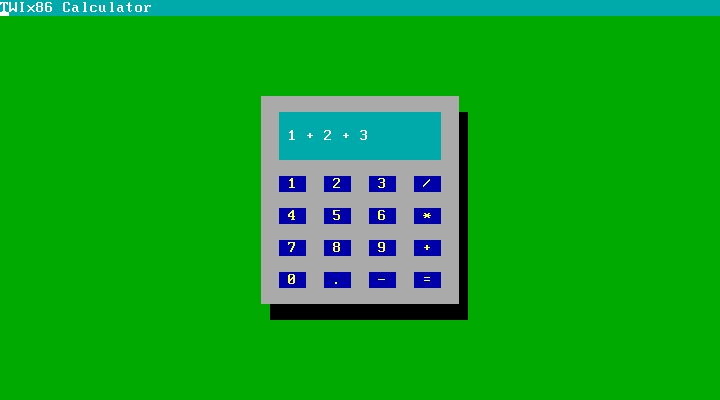
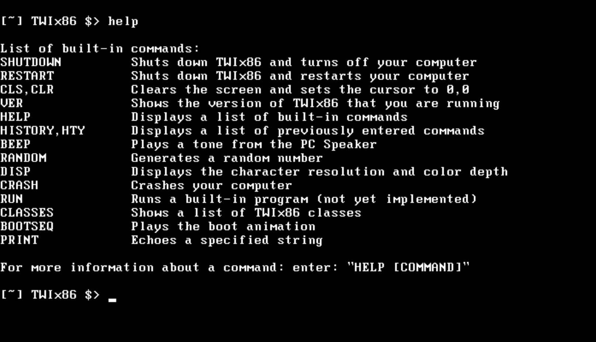

# TWIx86
A small but feature-rich operating system made in C# using the COSMOS kernel

This project started May 10th, 2021, and has grown a lot since.

Project started by [@TechWorldInc](https://github.com/TechWorldInc), but expanded by other users as well.

Down below you can find the credits for those users:

## Credits

HUGE thanks to [@Picoseconds](https://github.com/Picoseconds) for helping me build the logic behind the Calculator. (`[~] TWIx86 $> calc`)

Want to expand this list? Contact me!

## Screenshots

